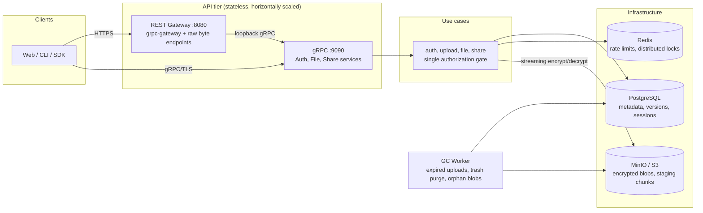
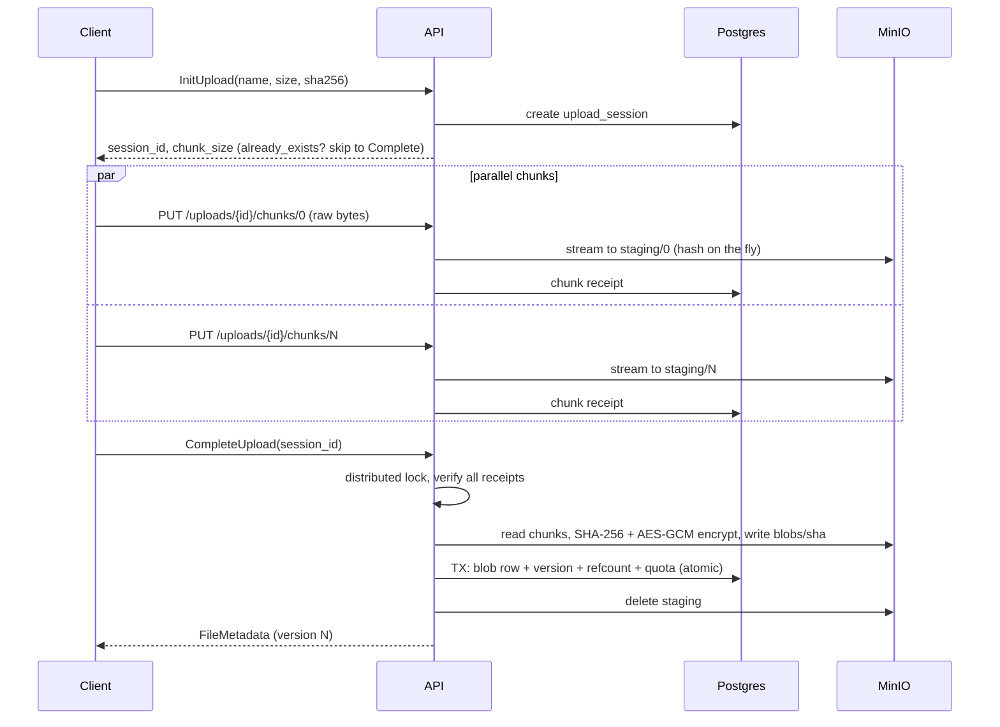
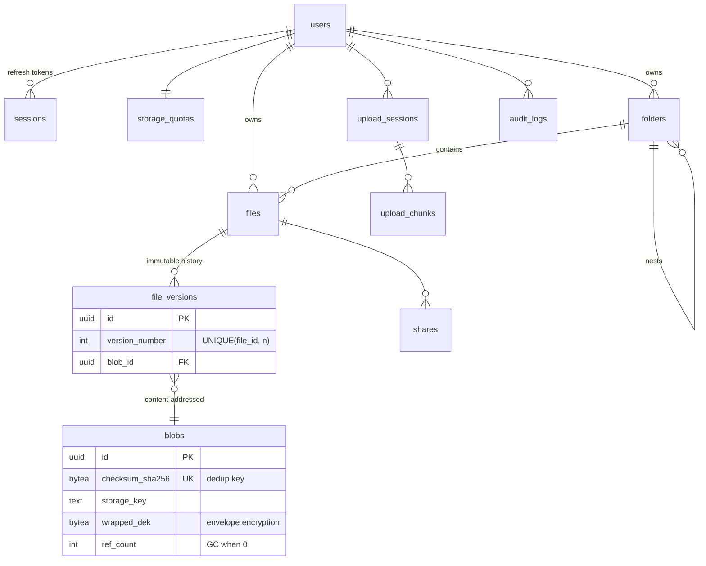

# Strato

**A production-grade distributed file storage platform** — chunked resumable uploads, content-addressed deduplication, envelope encryption at rest, immutable version history, and sharing. Think "self-hosted Dropbox core," built to demonstrate how a senior backend engineer designs, secures, and operates a storage system in Go.

[](../../actions)
[](go.mod)
[](LICENSE)

---

## Highlights

- **Resumable chunked uploads** — sessions with per-chunk receipts in Postgres; clients crash, ask `GET /v1/uploads/{id}`, and resend only missing chunks. Chunks stream straight to object storage, never through JSON.
- **Content-addressed deduplication** — versions reference blobs keyed by plaintext SHA-256 with transactional refcounting. Uploading a file the system already has transfers **zero bytes**.
- **Envelope encryption (AES-256-GCM)** — every blob gets its own DEK, encrypted with a segmented STREAM construction (64 KiB authenticated segments → constant-memory streaming for multi-GB files, truncation attacks detected). DEKs are wrapped by a master KEK; rotating the KEK re-wraps keys, not terabytes.
- **Immutable version history** — every write appends a version; "restore v3" appends a new version pointing at v3's content. History is never rewritten.
- **Real authentication** — Argon2id (OWASP parameters, transparent rehash-on-login), short-lived JWTs, rotating refresh tokens with **reuse detection** that revokes the whole session family on replay.
- **Sharing** — private grants (viewer/editor/owner), public links with optional expiry and Argon2id password gates; raw tokens are never stored, only SHA-256 digests.
- **Defense in depth** — IDOR-safe error mapping (unauthorized ≡ nonexistent), single authorization gate shared by all use cases, sliding-window rate limiting in Redis, application-layer signed URLs, audit logging, strict name validation (directory traversal is impossible by construction).
- **Operable** — Prometheus histograms, OpenTelemetry tracing, structured `slog` logs with request IDs, health/readiness probes, graceful shutdown, K8s manifests with HPA + PDB.

## Architecture



**Layering (Clean Architecture).** `entity` (pure domain) ← `domain` (ports + errors) ← `usecase` (business rules) ← `repository`/`storage`/`auth` (adapters) ← `transport` (thin handlers) ← `app` (DI). Dependencies point strictly inward; business logic never touches SQL, SDKs, or protobuf.

### Upload sequence



### ER diagram



## Quick start

```bash
git clone https://github.com/unisghimire/strato && cd strato

# 1. Secrets + infrastructure (Postgres, Redis, MinIO, Prometheus, Grafana, Jaeger)
cp .env.example .env && ./scripts/gen-secrets.sh >> .env
make dev-up

# 2. Generate proto stubs, migrate, run
make proto tidy migrate run
```

Or fully containerized: `docker compose -f docker/docker-compose.yml --profile app up --build`.

Try it:

```bash
curl -s localhost:8080/v1/auth/register -d '{"email":"me@example.com","password":"a-strong-password","display_name":"Me"}'
TOKEN=$(curl -s localhost:8080/v1/auth/login -d '{"email":"me@example.com","password":"a-strong-password"}' | jq -r .access_token)

# Chunked upload
SHA=$(sha256sum file.bin | cut -d' ' -f1)
SESSION=$(curl -s localhost:8080/v1/uploads -H "Authorization: Bearer $TOKEN" \
  -d "{\"name\":\"file.bin\",\"size_bytes\":\"$(stat -c%s file.bin)\",\"checksum_sha256\":\"$SHA\"}" | jq -r .session_id)
curl -T file.bin "localhost:8080/v1/uploads/$SESSION/chunks/0" -H "Authorization: Bearer $TOKEN"
curl -s -X POST "localhost:8080/v1/uploads/$SESSION/complete" -H "Authorization: Bearer $TOKEN" -d '{}'
```

Dashboards: Grafana `localhost:3000` (admin/admin) · Prometheus `localhost:9091` · Jaeger `localhost:16686` · MinIO console `localhost:9001`.

## Testing

```bash
make test              # unit tests, race detector (use cases run against in-memory fakes)
make test-integration  # repository tests vs real Postgres (incl. concurrent quota enforcement)
make test-e2e          # black-box REST flow vs a running stack
make bench             # AES-GCM streaming throughput, Argon2id cost
```

The most interesting tests, if you're skimming:

| Test | Proves |
|---|---|
| `TestQuotaConcurrentEnforcement` (integration) | 20 racing writers can never jointly exceed quota — check+add is one SQL statement |
| `TestRefreshReuseRevokesFamily` | stolen refresh tokens kill the whole session family |
| `TestStreamTamperDetection/truncated_at_segment_boundary` | the STREAM final-flag defeats ciphertext truncation |
| `TestUploadDeduplicatesIdenticalContent` | second upload of same bytes stores nothing new, refcount = 2 |
| `TestFileAccessIsIsolatedBetweenUsers` | strangers get `NotFound`, never `PermissionDenied` (no IDOR oracle) |

## Documentation

| Doc | Contents |
|---|---|
| [docs/architecture.md](docs/architecture.md) | Layering, data model decisions, upload/download pipelines, GC design |
| [docs/api.md](docs/api.md) | REST + gRPC surface, auth, pagination, error model |
| [docs/security.md](docs/security.md) | Threat model, crypto design, token lifecycle, IDOR/SQLi/traversal defenses |
| [docs/deployment.md](docs/deployment.md) | Compose and Kubernetes deployment, config reference, secret management |
| [docs/performance.md](docs/performance.md) | Streaming memory model, connection pooling, benchmark numbers |
| [docs/scaling.md](docs/scaling.md) | Path from one node to millions of files: shard points, cache layers, CDN |

## Project layout

```
cmd/            server | worker | migrate binaries
proto/          gRPC contracts (buf-managed, REST annotations)
internal/
  entity/       pure domain types
  domain/       ports (interfaces) + error taxonomy
  usecase/      business logic — the only place rules live
  repository/   postgres (pgx, explicit SQL) + redis adapters
  storage/      MinIO BlobStore + key layout
  auth/         JWT manager, identity context
  service/      URL signer, GC
  transport/    gRPC + HTTP handlers (no business logic)
  middleware/   auth, rate limit, logging, metrics, recovery
  app/          dependency injection + lifecycle
pkg/            reusable: streaming crypto, retry, pagination, workerpool
migrations/     golang-migrate SQL (indexes + constraints documented inline)
```

## License

MIT — see [LICENSE](LICENSE).
